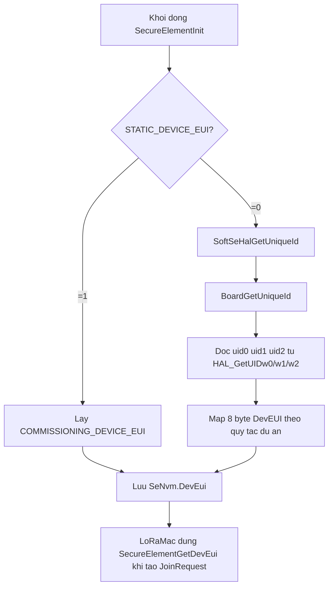
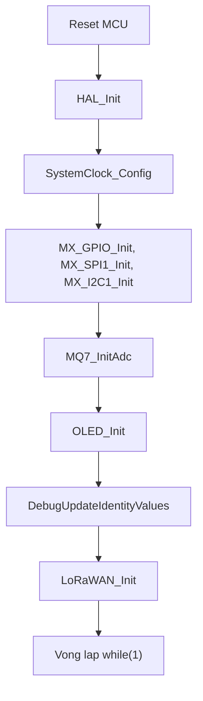
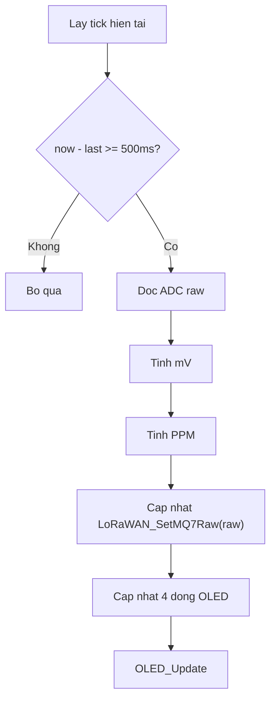
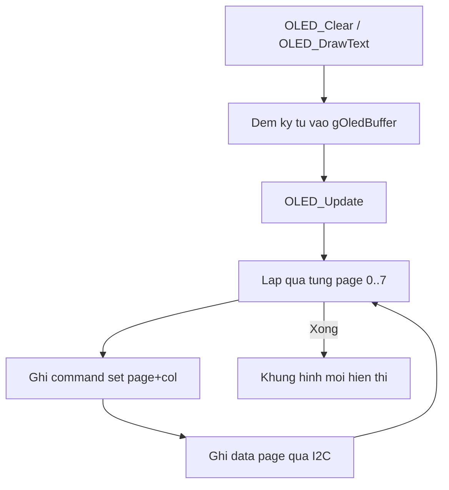
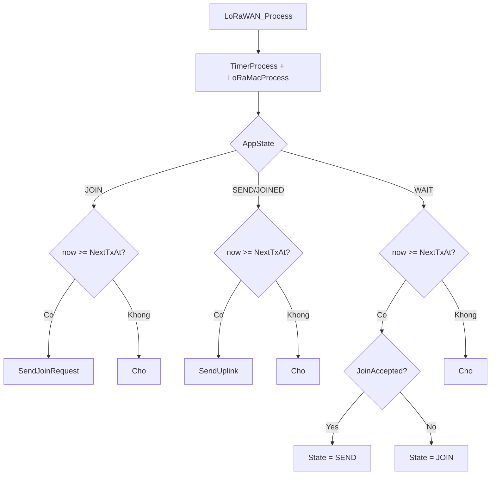
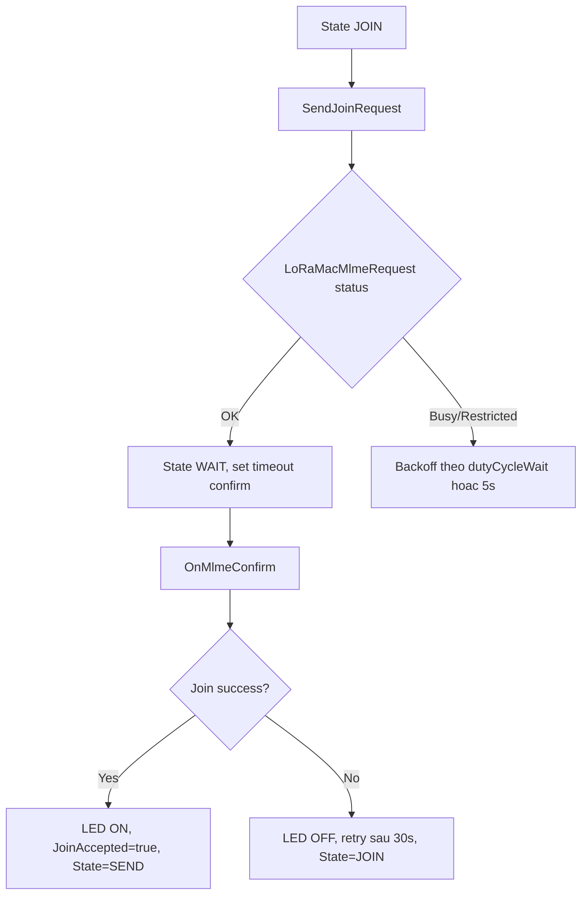
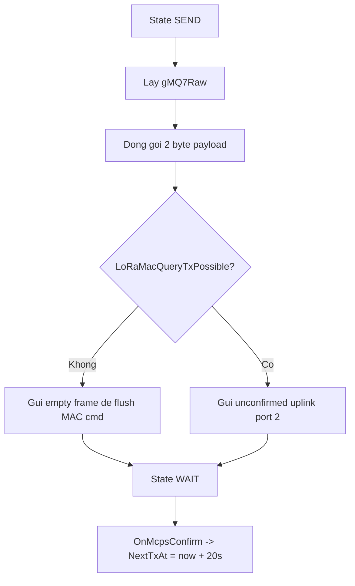
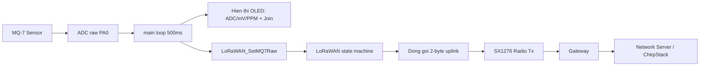

# Bao cao thuyet minh trien khai LoRa Node (STM32F401 + LoRaMac)

## 1) Tong quan he thong

Node duoc trien khai tren STM32F401, ket hop:
- Cam bien MQ-7 do nong do CO qua ADC (PA0).
- OLED I2C de hien thi ADC, dien ap, PPM va trang thai join LoRaWAN.
- Stack LoRaMac 4.x (OTAA, region AS923) de ket noi Gateway/Network Server.

Luong du lieu chinh:
1. MCU doc ADC MQ-7 dinh ky.
2. Quy doi ADC -> mV -> PPM (phuc vu hien thi).
3. Day ADC raw vao module LoRaWAN de tao uplink payload 2 byte.
4. LoRaWAN state machine xu ly JOIN/SEND/WAIT.

---

## 2) Khoi Commissioning (tham so OTAA)

### Chuc nang
- Cung cap tham so cau hinh LoRaWAN:
  - `ACTIVE_REGION` = `LORAMAC_REGION_AS923`
  - `DevEui`, `JoinEui`, `AppKey`
- Du an dang dung `COMMISSIONING_STATIC_DEVICE_EUI = 1` nen DevEUI van hanh o che do co dinh.
- Gia tri DevEUI co dinh nay duoc tao tu UID thuc te cua node qua buoc debug, sau do nhap nguoc vao `COMMISSIONING_DEVICE_EUI` de su dung on dinh.

### Logic
1. Khi compile, cac macro trong `Commissioning.h` duoc bien dich thanh mang byte.
2. Khi runtime, `LoRaWAN_Init()` nap `AppKey/NwkKey` vao MIB cua LoRaMac.
3. `SendJoinRequest()` gui lenh OTAA Join voi datarate DR_2.

### Luu y bao cao
- Trinh bay ro rang: thong so bao mat (AppKey) dang hard-code, phu hop demo/lab, khong phu hop production.

### 2.1) Mo ta chi tiet cach tao DevEUI

He thong ho tro 2 che do tao DevEUI:
1. DevEUI tinh (manual):
- Bat bang `COMMISSIONING_STATIC_DEVICE_EUI = 1` trong `Commissioning.h`.
- Gia tri su dung truc tiep tu macro `COMMISSIONING_DEVICE_EUI` (8 byte, big-endian).
- Trong quy trinh trien khai thuc te, gia tri nay thuong duoc lay tu UID chip (qua debug), roi copy nguoc vao macro de khoa dinh danh node.

2. DevEUI dong (tu UID cua STM32):
- Bat bang `COMMISSIONING_STATIC_DEVICE_EUI = 0`.
- Trong secure element soft-se, `SecureElementInit()` goi `SoftSeHalGetUniqueId()`.
- `SoftSeHalGetUniqueId()` goi tiep `BoardGetUniqueId()` de lay UID phan cung.

Quy tac map UID -> DevEUI hien tai cua du an (trong `Core/LoRaMac/board/board.c`):
- Doc 3 word UID 32-bit:
  - `uid0 = HAL_GetUIDw0()`
  - `uid1 = HAL_GetUIDw1()`
  - `uid2 = HAL_GetUIDw2()`
- Gan 8 byte DevEUI theo thu tu:
  - `id[0] = uid0[31:24]`
  - `id[1] = uid0[23:16]`
  - `id[2] = uid0[15:8]`
  - `id[3] = uid0[7:0]`
  - `id[4] = uid1[31:24]`
  - `id[5] = uid1[23:16]`
  - `id[6] = uid2[31:24]`
  - `id[7] = uid2[23:16]`

Luu y ky thuat quan trong:
- DevEUI trong secure element la mang 8 byte big-endian.
- Khi tao JoinRequest, LoRaMac copy DevEUI nay vao truong `JoinReq.DevEUI`.
- Qua trinh serialize cua LoRaMac se dao thu tu byte theo yeu cau over-the-air (LSB first trong frame Join), vi vay can de nguyen quy tac map o tren cho dung voi stack.

Luu do tao DevEUI:

Thuc trang cua project nay:
- Dang de `COMMISSIONING_STATIC_DEVICE_EUI = 1`, nen runtime su dung DevEUI co dinh trong `Commissioning.h`.
- Quy trinh da ap dung: doc UID trong `main.c` de debug -> suy ra DevEUI cua node -> nhap nguoc vao `COMMISSIONING_DEVICE_EUI`.
- Vi vay DevEUI dang dung van la static khi van hanh, nhung nguon goc gia tri la UID thuc te cua tung thiet bi.

---

## 3) Khoi khoi tao he thong (`main.c`)

### Chuc nang
- Khoi tao HAL, clock, GPIO/SPI/I2C.
- Khoi tao ADC cho MQ-7 bang thanh ghi truc tiep.
- Khoi tao OLED.
- Khoi tao LoRaWAN app.

### Luong khoi dong

---

## 4) Khoi do MQ-7 va xu ly PPM

### Chuc nang
- `MQ7_ReadRaw()` doc ADC1 channel 0 (PA0), timeout 10 ms.
- `MQ7_AdcToPpm()` quy doi ADC raw sang nong do CO uoc luong (PPM).

### Cong thuc su dung
- Dien ap dau ra:
  \[
  V_{out} = ADC \times \frac{3.3}{4095}
  \]
- Dien tro cam bien:
  \[
  R_s = R_L \times \frac{V_{ref}-V_{out}}{V_{out}}
  \]
- Ty so:
  \[
  ratio = \frac{R_s}{R_0}
  \]
- Duong cong xap xi:
  \[
  PPM = A \times ratio^B
  \]
  voi `A = 99.042`, `B = -1.518`.

### Luong xu ly dinh ky 500 ms

---

## 5) Khoi OLED (`oled.c`)

### Chuc nang
- Tu dong do I2C address (0x3C, fallback 0x3D).
- Khoi tao SSD1306/SH1106 bang chuoi lenh.
- Duy tri frame buffer RAM va ghi tung page ra man hinh.

### Luong cap nhat hien thi

---

## 6) Khoi LoRaWAN app (`lora_app.c`)

### 6.1 State machine
Trang thai:
- `APP_STATE_JOIN`: gui OTAA Join.
- `APP_STATE_SEND`: gui uplink.
- `APP_STATE_WAIT`: doi callback/timeout de chuyen trang thai.
- `APP_STATE_IDLE`, `APP_STATE_JOINED`: khai bao bo tro.

### 6.2 Luong xu ly chinh trong `LoRaWAN_Process()`

### 6.3 Luong Join OTAA

### 6.4 Luong gui uplink
- Payload ung dung dung 2 byte:
  - Byte 0: MSB cua ADC raw MQ-7.
  - Byte 1: LSB cua ADC raw MQ-7.
- Port: `2`, datarate: `DR_2`, chu ky gui: `20s`.
- Neu MAC con pending command, gui frame rong de flush.

---

## 7) Luong tong the end-to-end

---

## 8) Tom tat theo tung phan de dua vao bao cao

1. Phan cau hinh OTAA:
- Dinh nghia bo khoa/ID va region trong `Commissioning.h`.
- LoRaMac nap key qua MIB truoc khi start stack.

2. Phan khoi tao phan cung:
- HAL + Clock + peripheral co ban (GPIO/SPI/I2C).
- ADC cho MQ-7 duoc toi uu bang truy cap thanh ghi.
- OLED tu dong nhan dia chi I2C.

3. Phan xu ly cam bien:
- Chu ky 500 ms doc ADC.
- Quy doi sang mV va PPM theo mo hinh ham mu.
- Day ADC raw sang khoi LoRaWAN.

4. Phan LoRaWAN:
- Su dung OTAA, state machine JOIN/SEND/WAIT.
- Co callback xac nhan join/tx de dong bo trang thai.
- Uplink unconfirmed moi 20 s, payload 2 byte.

5. Phan giao dien OLED:
- Hien thi song song trang thai he thong va chat luong khong khi.
- Bieu tuong tron dac/rong cho biet da join hay chua.

---

## 9) De xuat mo rong (neu can dua vao muc huong phat trien)

- Them bo loc trung binh truot cho ADC de giam nhieu.
- Dong goi payload theo dinh dang co version (VD: [ver|adc_msb|adc_lsb|battery]).
- Them downlink command de doi chu ky gui tu server.
- Chuyen key ra secure element hoac co che provisioning an toan.
