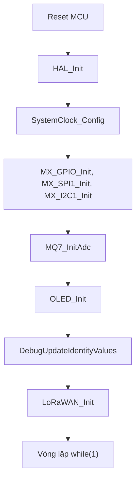
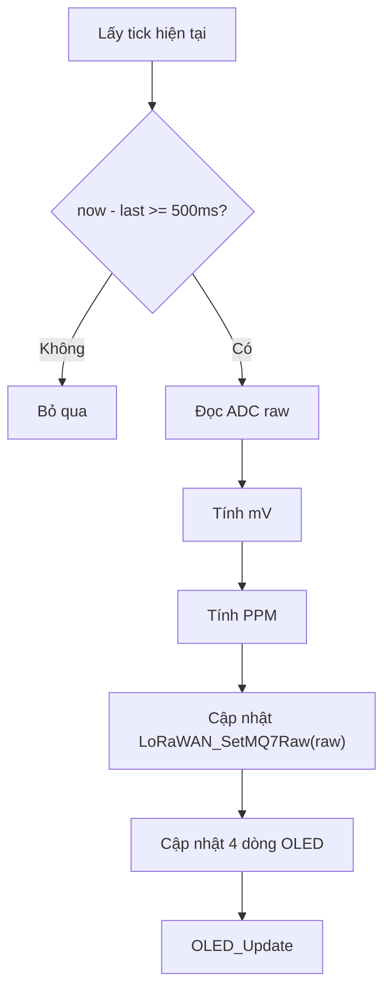
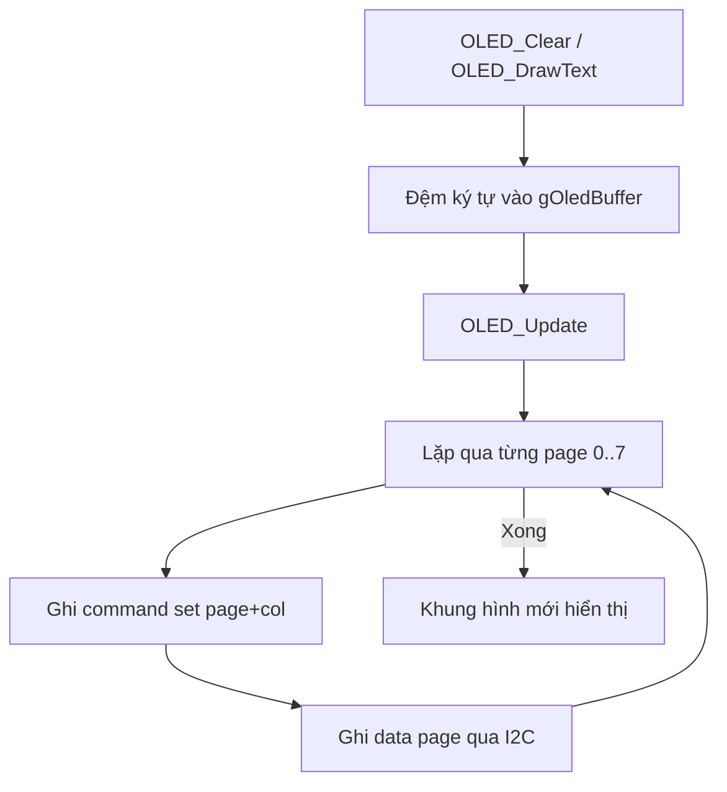
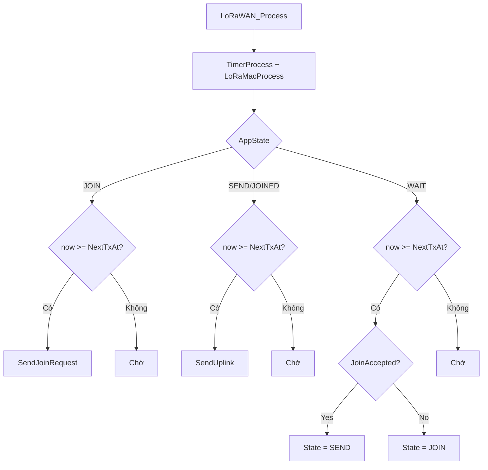

# Báo cáo thuyết minh triển khai LoRa Node (STM32F401 + LoRaMac)

## 1) Tổng quan hệ thống

Node được triển khai trên STM32F401, kết hợp:
- Cảm biến MQ-7 đo nồng độ CO qua ADC (PA0).
- OLED I2C để hiển thị ADC, điện áp, PPM và trạng thái join LoRaWAN.
- Stack LoRaMac 4.x (OTAA, region AS923) để kết nối Gateway/Network Server.

Luồng dữ liệu chính:
1. MCU đọc ADC MQ-7 định kỳ.
2. Quy đổi ADC -> mV -> PPM (phục vụ hiển thị).
3. Đẩy ADC raw vào module LoRaWAN để tạo uplink payload 2 byte.
4. LoRaWAN state machine xử lý JOIN/SEND/WAIT.

---

## 2) Khối Commissioning (tham số OTAA)

### Chức năng
- Cung cấp tham số cấu hình LoRaWAN:
  - `ACTIVE_REGION` = `LORAMAC_REGION_AS923`
  - `DevEui`, `JoinEui`, `AppKey`
- Dự án đang dùng `COMMISSIONING_STATIC_DEVICE_EUI = 1` nên DevEUI vận hành ở chế độ cố định.
- Giá trị DevEUI cố định này được tạo từ UID thực tế của node qua bước debug, sau đó nhập ngược vào `COMMISSIONING_DEVICE_EUI` để sử dụng ổn định.

### Logic
1. Khi compile, các macro trong `Commissioning.h` được biên dịch thành mảng byte.
2. Khi runtime, `LoRaWAN_Init()` nạp `AppKey/NwkKey` vào MIB của LoRaMac.
3. `SendJoinRequest()` gửi lệnh OTAA Join với datarate DR_2.

### Lưu ý báo cáo
- Trình bày rõ ràng: thông số bảo mật (AppKey) đang hard-code, phù hợp demo/lab, không phù hợp production.

### 2.1) Mô tả chi tiết cách tạo DevEUI

Hệ thống hỗ trợ 2 chế độ tạo DevEUI:
1. DevEUI tĩnh (manual):
- Bật bằng `COMMISSIONING_STATIC_DEVICE_EUI = 1` trong `Commissioning.h`.
- Giá trị sử dụng trực tiếp từ macro `COMMISSIONING_DEVICE_EUI` (8 byte, big-endian).
- Trong quy trình triển khai thực tế, giá trị này thường được lấy từ UID chip (qua debug), rồi copy ngược vào macro để khóa định danh node.

2. DevEUI động (từ UID của STM32):
- Bật bằng `COMMISSIONING_STATIC_DEVICE_EUI = 0`.
- Trong secure element soft-se, `SecureElementInit()` gọi `SoftSeHalGetUniqueId()`.
- `SoftSeHalGetUniqueId()` gọi tiếp `BoardGetUniqueId()` để lấy UID phần cứng.

Quy tắc map UID -> DevEUI hiện tại của dự án (trong `Core/LoRaMac/board/board.c`):
- Đọc 3 word UID 32-bit:
  - `uid0 = HAL_GetUIDw0()`
  - `uid1 = HAL_GetUIDw1()`
  - `uid2 = HAL_GetUIDw2()`
- Gán 8 byte DevEUI theo thứ tự:
  - `id[0] = uid0[31:24]`
  - `id[1] = uid0[23:16]`
  - `id[2] = uid0[15:8]`
  - `id[3] = uid0[7:0]`
  - `id[4] = uid1[31:24]`
  - `id[5] = uid1[23:16]`
  - `id[6] = uid2[31:24]`
  - `id[7] = uid2[23:16]`

Lưu ý kỹ thuật quan trọng:
- DevEUI trong secure element là mảng 8 byte big-endian.
- Khi tạo JoinRequest, LoRaMac copy DevEUI này vào trường `JoinReq.DevEUI`.
- Quá trình serialize của LoRaMac sẽ đảo thứ tự byte theo yêu cầu over-the-air (LSB first trong frame Join), vì vậy cần để nguyên quy tắc map ở trên cho đúng với stack.

Lưu đồ tạo DevEUI:

Thực trạng của project này:
- Đang để `COMMISSIONING_STATIC_DEVICE_EUI = 1`, nên runtime sử dụng DevEUI cố định trong `Commissioning.h`.
- Quy trình đã áp dụng: đọc UID trong `main.c` để debug -> suy ra DevEUI của node -> nhập ngược vào `COMMISSIONING_DEVICE_EUI`.
- Vì vậy DevEUI đang dùng vẫn là static khi vận hành, nhưng nguồn gốc giá trị là UID thực tế của từng thiết bị.

---

## 3) Khối khởi tạo hệ thống (`main.c`)

### Chức năng
- Khởi tạo HAL, clock, GPIO/SPI/I2C.
- Khởi tạo ADC cho MQ-7 bằng thanh ghi trực tiếp.
- Khởi tạo OLED.
- Khởi tạo LoRaWAN app.

### Luồng khởi động

---

## 4) Khối đo MQ-7 và xử lý PPM

### Chức năng
- `MQ7_ReadRaw()` đọc ADC1 channel 0 (PA0), timeout 10 ms.
- `MQ7_AdcToPpm()` quy đổi ADC raw sang nồng độ CO ước lượng (PPM).

### Công thức sử dụng
- Điện áp đầu ra:
  $$
  V_{out} = ADC \times \frac{3.3}{4095}
  $$
- Điện trở cảm biến:
  $$
  R_s = R_L \times \frac{V_{ref}-V_{out}}{V_{out}}
  $$
- Tỷ số:
  $$
  ratio = \frac{R_s}{R_0}
  $$
- Đường cong xấp xỉ:
  $$
  PPM = A \times ratio^B
  $$
  với A = 99.042, B = -1.518.

### Luồng xử lý định kỳ 500 ms

---

## 5) Khối OLED (`oled.c`)

### Chức năng
- Tự động dò I2C address (0x3C, fallback 0x3D).
- Khởi tạo SSD1306/SH1106 bằng chuỗi lệnh.
- Duy trì frame buffer RAM và ghi từng page ra màn hình.

### Luồng cập nhật hiển thị

---

## 6) Khối LoRaWAN app (`lora_app.c`)

### 6.1 State machine
Trạng thái:
- `APP_STATE_JOIN`: gửi OTAA Join.
- `APP_STATE_SEND`: gửi uplink.
- `APP_STATE_WAIT`: đợi callback/timeout để chuyển trạng thái.
- `APP_STATE_IDLE`, `APP_STATE_JOINED`: khai báo bổ trợ.

### 6.2 Luồng xử lý chính trong `LoRaWAN_Process()`

### 6.3 Luồng Join OTAA

### 6.4 Luồng gửi uplink
- Payload ứng dụng dùng 2 byte:
  - Byte 0: MSB của ADC raw MQ-7.
  - Byte 1: LSB của ADC raw MQ-7.
- Port: `2`, datarate: `DR_2`, chu kỳ gửi: `20s`.
- Nếu MAC còn pending command, gửi frame rỗng để flush.

---

## 7) Luồng tổng thể end-to-end

---

## 8) Tóm tắt theo từng phần để đưa vào báo cáo

1. Phần cấu hình OTAA:
- Định nghĩa bộ khóa/ID và region trong `Commissioning.h`.
- LoRaMac nạp key qua MIB trước khi start stack.

2. Phần khởi tạo phần cứng:
- HAL + Clock + peripheral cơ bản (GPIO/SPI/I2C).
- ADC cho MQ-7 được tối ưu bằng truy cập thanh ghi.
- OLED tự động nhận địa chỉ I2C.

3. Phần xử lý cảm biến:
- Chu kỳ 500 ms đọc ADC.
- Quy đổi sang mV và PPM theo mô hình hàm mũ.
- Đẩy ADC raw sang khối LoRaWAN.

4. Phần LoRaWAN:
- Sử dụng OTAA, state machine JOIN/SEND/WAIT.
- Có callback xác nhận join/tx để đồng bộ trạng thái.
- Uplink unconfirmed mỗi 20 s, payload 2 byte.

5. Phần giao diện OLED:
- Hiển thị song song trạng thái hệ thống và chất lượng không khí.
- Biểu tượng tròn đặc/rỗng cho biết đã join hay chưa.

---

## 9) Đề xuất mở rộng (nếu cần đưa vào mục hướng phát triển)

- Thêm bộ lọc trung bình trượt cho ADC để giảm nhiễu.
- Đóng gói payload theo định dạng có version (VD: [ver|adc_msb|adc_lsb|battery]).
- Thêm downlink command để đổi chu kỳ gửi từ server.
- Chuyển key ra secure element hoặc cơ chế provisioning an toàn.
